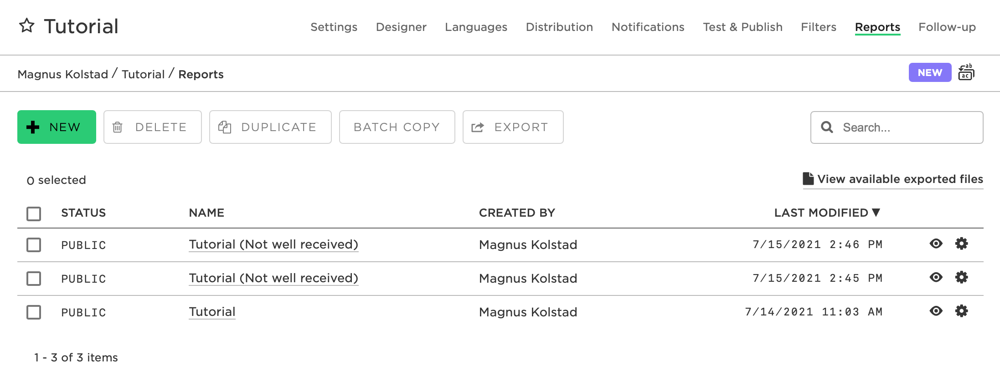
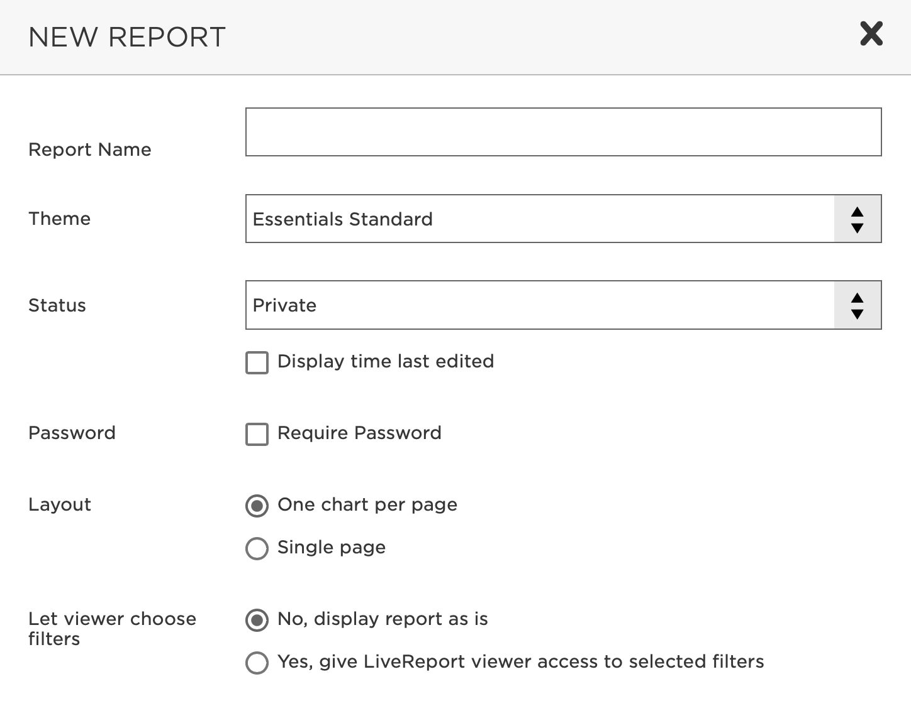
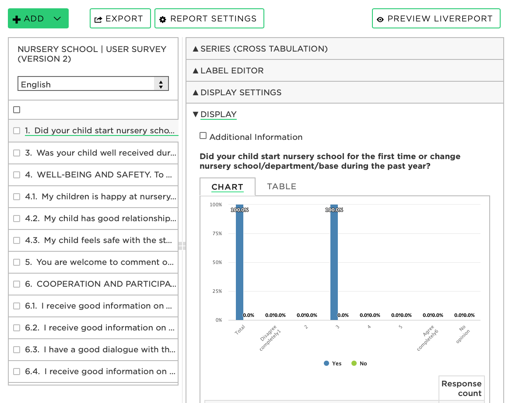
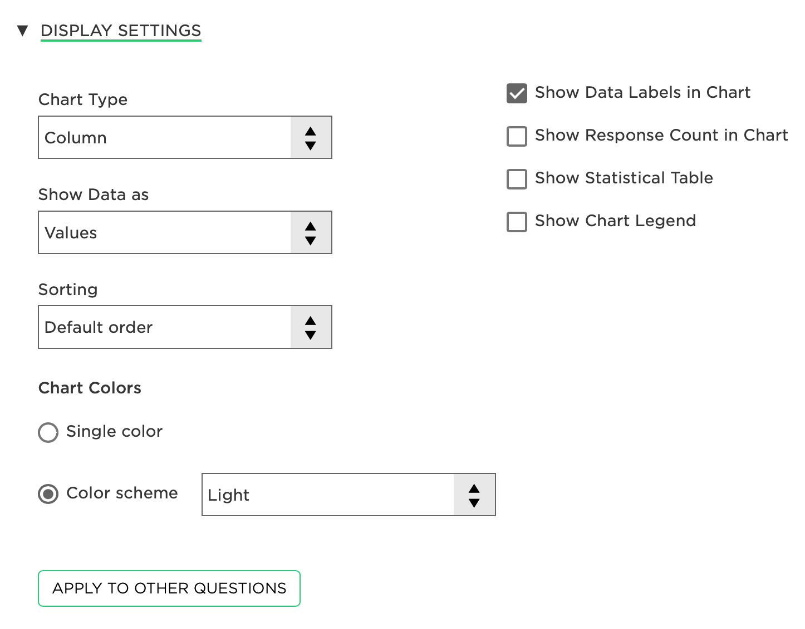
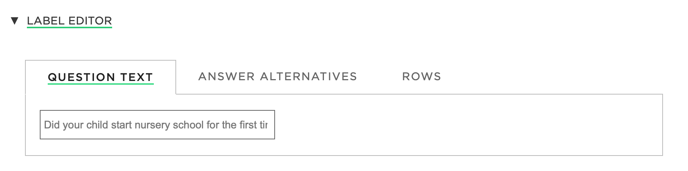
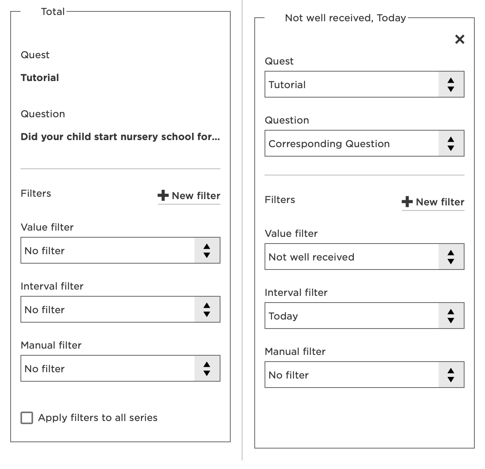
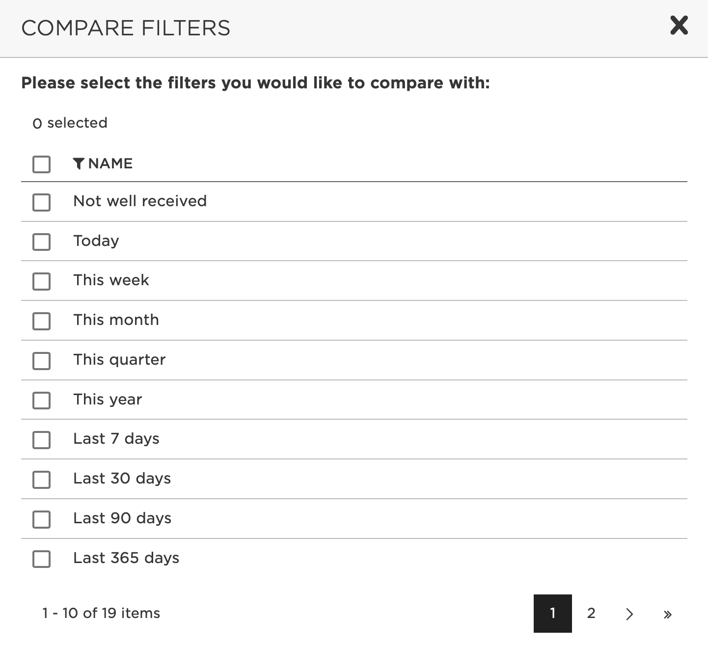
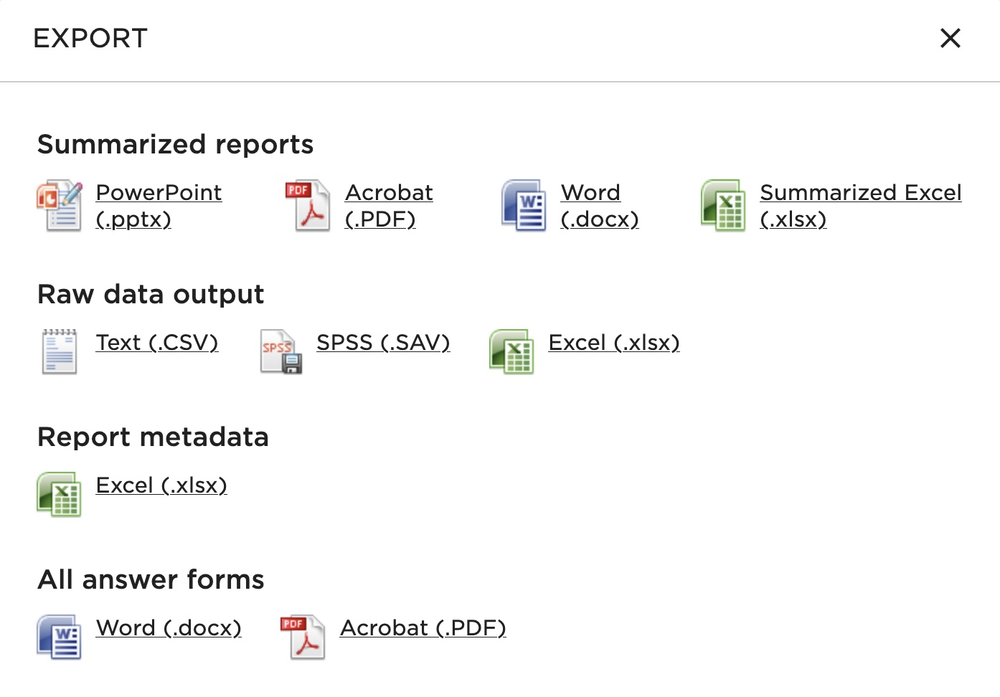

Reports are not your actual data—that’s stored in the <Link to="/follow-up">Follow&#8209;up tab</Link>. So if you feel like you’ve messed up the report—or if you accidentally delete a report—you can just start over. 

In other words: **don’t be afraid to experiment**. Nothing you do here is permanent.

## The #1 most frequently asked question

“Why is my report missing questions?”

Because Essentials doesn’t automatically add questions to reports. So, if you create a report and later add questions in the <UI content="Designer"/> tab, the report won’t be up to date with the current quest setup.

There are two ways to solve this:

  1. You can add the new questions manually to your existing report.
    
    

      <h3>How to add (missing) questions to a report</h3>
      
Enter the <UI content="Reports" /> tab. Enter your report by clicking on it. <UI content="Add"/> &rarr; <UI content="Add questions" />. Select your missing questions. Click <UI content="OK" />.

    

    
  2. You can delete your report and let Essentials do the work for you. The new report will include all the current questions in the designer. It will, of course, also delete any work you’ve done on your report (such as [display settings](https://community.questback.com/s/article/Questback-Essentials-How-to-use-Display-Settings) and [text items](#the-new-report)).

    

      <h3>How to delete and recreate a report</h3>
      
Enter the <UI content="Reports" /> tab. Select your report by ticking off the far-left box. Click <UI content="Delete" />. Refresh the page in your browser.

    

## Getting started with reports

  <h3>How to access reports</h3>
  
Enter your quest. Click <UI content="Reports" /> in the top-right corner of Essentials.

The first time you visit the reports, you’ll find an auto-generated report with the same name as your quest. This report is always here—if you delete it, Essentials will create a new one with all your questions from the designer upon refreshing the site.

## Creating a new report

  <h3>How to create a new report</h3>
  
In the <UI content="Reports" /> tab, click <UI content="New" />. Choose report settings and click <UI content="OK"/>

You can change the report settings later on.

The new report will be empty. Let’s add some content.

  <h3>How to add content to a report</h3>
  
In your report, click the green <UI content="Add" /> button. This will reveal five options—

  <ol>
    <li><strong><UI content="Add questions" /></strong> lets you add the questions you’ve created in the designer. You can tick off questions separately or click <UI content="Select all in entire list" />.</li>
    <li><strong><UI content="Add text item" /></strong> adds a section in your report in which you can write simple text or add pictures with the Essentials text editor.</li>
    <li><strong><UI content="Add response log" /></strong> adds the response history of your quest to your report.</li>
    <li><strong><UI content="Add section" /></strong> adds a new section, allowing you to structure your report.</li>
    <li><strong><UI content="Add index" /></strong> lets you add an index to your report—a section in which you can aggregate data across several questions. You choose the index content by setting the weight of your questions.</li>
  </ol>

The content will be displayed in the left column. From here you can enter individual questions and more by clicking on them. These will show up in the right column:

## Designing questions

<MainArticle title="Display settings" source="/reports/display-settings" />

  <h3>How to change display settings</h3>
  
<UI content="Reports"/> &rarr; your report. Enter the question you wish to design by clicking on it. Click <UI content="Display settings"/>.

You can customize the question’s labels as well. These settings have their own menu.

  <h3>How to access label settings</h3>
  
<UI content="Reports"/> → your report. Enter the question you wish to design by clicking on it. Click <UI content="Label editor"/>.

You can remove labels from your question simply by overriding the standard label (the question’s question text, answer alternatives, or rows) with a white-space character—such as a horizontal space.

  <h3>How to remove question labels</h3>
  
<UI content="Reports"/> → your report. Enter the question you wish to design by clicking on it. Click <UI content="Label editor"/>. Click on the gray text under either <UI content="Question text"/>, <UI content="Answer alternatives"/>, or <UI content="Rows"/>. Type a word space with your space bar.

## Series & filters

<MainArticle title="How to use series" source="/filters/how-to-use-series" />

  <h3>How to access series</h3>
  
<UI content="Reports"/> → your report. Enter the question you wish to work with by clicking on it. Click <UI content="Series"/>.

You can set <Link to="/filters/how-to-use-value-filters">value filters</Link>, <Link to="/filters/how-to-use-interval-filters">interval filters</Link>, and <Link to="/filters/how-to-use-manual-filters">manual filters</Link>. You can also create new filters by clicking <UI content="New filter"/>.

If you’re working on a shared quest, there might be many different filters made by different people. You can hide these and only show your own.

  <h3>How to hide others’ filters</h3>
  
<UI content="Reports"/> &rarr; your report. Enter the question you wish to work with by clicking on it. Click <UI content="Series"/>. Tick off the box <UI content="Only display my filters"/>.

<SeeAlso title="How to use filters" source="/filters/how-to-use-filters"/>

## Comparisons

<RelatedArticle title="Comparing different quests" source="/reports/comparing-different-quests" />

Let’s look at the different types of series—first, a *comparison*.

  <h3>How to add a comparison</h3>
  
<UI content="Reports"/> &rarr; your report. Enter your question. Click the <UI content="Series"/> tab (it’s the uppermost tab). <UI content="Add series"/> &rarr; <UI content="Add comparison"/>.

This will add a new box like the one that is there by default. Here you can add your preferred filters:
  

To compare several filters, you can select <UI content="Add comparison"/> several times and add the preferred filters. But it’s much faster to use **<UI content="Add batch comparison"/>** instead. This will list all your available filters and create a comparison for each filter you select:

<SeeAlso title="Batch comparisons" source="/filters/batch-comparisons" />

## Cross-tabulations

A *cross-tabulation* lets you compare different variables/answer alternatives on one or more questions. For example, by comparing different departments on questions regarding work satisfaction, you can easily find out which department thrives the most.

  <h3>How to add a cross-tabulation</h3>
  
<UI content="Reports"/> &rarr; your report. Enter the question you want to cross-tabulate from by clicking on it. <UI content="Series"/> &rarr; <UI content="Add series"/> &rarr; <UI content="Add cross-tabulation"/> &rarr; <UI content="Select question"/>. Select the question with which you wish to cross-tabulate. Click <UI content="OK"/>.

You can also choose to only cross-tabulate based on certain answers pertaining to the question.

  <h3>How to cross-tabulate only some answers</h3>
  
<UI content="Reports"/> &rarr; your report. Enter the question you want to cross-tabulate from. <UI content="Series"/> &rarr; <UI content="Add series"/> &rarr; <UI content="Add cross-tabulation"/> &rarr; <UI content="Select question"/>. Select the question you wish to cross-tabulate with. Click <UI content="Select alternatives to show"/> and tick off the relevant alternative(s). Click <UI content="Save"/>.

## Creating a LiveReport

<MainArticle title="Using LiveReports" source="/reports/using-livereports" />

The *LiveReport* is an online version of your report. It’s easily accessible through a link and updates automatically. Each report you have will have its own LiveReport.

  <h3>How to view a LiveReport</h3>
  
Click <UI content="Preview LiveReport"/> from anywhere in your report.

By default, LiveReports are private. Meaning if you want to share the LiveReport, you must first make it public.

When public, anyone with the unique LiveReport link (found in Report settings) can access the LiveReport.

  <h3>How to change LiveReport privacy settings</h3>
  
<UI content="Reports"/> &rarr; your report &rarr; <UI content="Report settings"/>. Go to the <UI content="Status"/> section. Choose between private and public status.

For extra security, you can password-protect the LiveReport.

  <h3>How to password-protect a LiveReport</h3>
  
<UI content="Reports"/> &rarr; your report &rarr; <UI content="Report settings"/>. Tick off <UI content="Require password"/> and choose a password.

    
You can also choose to display the last time the LiveReport was updated.
  

  <h3>How to display the last-updated time in a LiveReport</h3>
  
<UI content="Reports"/> &rarr; your report &rarr; <UI content="Report settings"/>. Go to the <UI content="Status"/> section. Select the box <UI content="Display time last edited"/>.

If your quest is multi-lingual, you get to choose if the viewer should be able to select the LiveReport’s language when entering it.

  <h3>How to set LiveReport language settings</h3>
  
<UI content="Reports"/> &rarr; your report &rarr; <UI content="Report settings"/>. Go to <UI content="Let viewer choose choose language?"/>.

You’ll get three choices:

1. Yes, with flags.
1. Yes, without flags.
1. No, display in single language. This will let you choose between the quest’s available languages.

<SeeAlso title="Using additional languages" source="/languages/using-additional-languages" />

If your report has filters, you get to choose if the viewer should be able to apply filters on their own.

  
<UI content="Reports"/> &rarr; your report &rarr; <UI content="Report settings"/>. Go to <UI content="Let viewer choose filters?"/>.

You’ll get two choices:

1. *No, display report as is.*
1. *Yes, give LiveReport viewer access to selected filters.* This will reveal a box with available value and interval filters. Choose which you want to give the viewer access to.

<SeeAlso title="Using filters" source="/filters/using-filters"/>

You can also choose if you want one chart per page or have one single page with all charts.

  <h3>How to change LiveReport display settings</h3>
  
<UI content="Reports"/> &rarr; your report &rarr; <UI content="Report settings"/>. Go to the <UI content="Layout"/> section.

## Exporting a report

<MainArticle title="Exporting" source="/reports/exporting"/>

You can export reports with and without graphs in various different file formats.

  <h3>How to export a report (two methods)</h3>
  <ol>
    <li>Click <UI content="Reports"/>. Select your report by ticking off the far-left box. Click <UI content="Export"/>.</li>
    <li>Click <UI content="Reports"/>. Enter the report you wish to export by clicking on it. Click the <UI content="Export"/> button (it’s to the right of the <UI content="Add"/> button).</li>
  </ol>

This will reveal a window with options for report types and formats:

There are several different export settings you can change—

1. **<UI content="Delivery"/>**. Choose to which email address Essentials should send the exported file. You’ll also choose whether you want to receive an email with the exported file attached or an email with a link to download the file directly from Essential’s servers. The latter is more secure.

2. **<UI content="Include free-text input?"/>** (Free-text input = open answers from *Other* alternatives.)

3. **<UI content="Display settings"/>**. Choose whether you’d like to export charts and tables, only charts, or only tables. 

Note that the options in this window will vary slightly based on the type of export you’re doing.

There are also several filter settings you can change—

  1. If you want the name of the filters you have used to be displayed, tick off <UI content="Display name of filters in exported file"/>. 

  2. You can choose to override any filters in the report by ticking off under <UI content="Override filters"/>. This will allow you to override any existing filters in the report—*and it’s also the only way to use filters in raw-data reports.*

  3. <UI content="Batch exporting"/> lets you export up to ten unique reports at the same time with different filters. Tick off for <UI content="Batch export"/> and select the filters you’d like to use.

## Managing reports

  <h3>How to delete a report</h3>
  
Click <UI content="Reports"/>. Tick off the far-left box on the report you wish to delete. Click <UI content="Delete"/>.

  <h3>How to duplicate a report</h3>
  
Click <UI content="Reports"/>. Tick off the far-left box on the report you wish to duplicate. Click <UI content="Duplicate"/>.

## Batch copying reports

<MainArticle title="Batch copying" source="/reports/batch-copying"/>

If you want to create multiple unique reports based on a filter—e.g., you want to look at how a specific department scored—then *batch copying* is the way to go.

  <h3>How to batch copy reports</h3>
  
Click <UI content="Reports"/>. Select the report you wish to batch copy by ticking off the far-left box. Click the <UI content="Batch copy"/> button. Select the filters you’d like to use. Click <UI content="Next"/>. Set the report settings. <UI content="Next"/> &rarr; <UI content="OK"/>.

